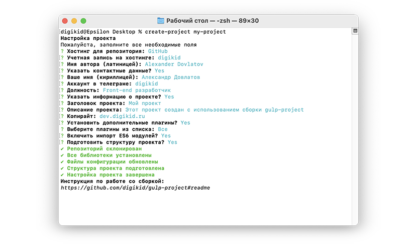

# Конфигуратор gulp-проекта


Данный конфигуратор позволяет развернуть в текущей директории сборку [gulp-project](https://github.com/digikid/gulp-project) и произвести настройку параметров.



## Установка

```shell
npm i -g digikid/create-project
```

## Запуск

Для запуска перейдите в директорию, где нужно создать проект, а затем запустите команду:

```shell
create-project
```

Через командную строку можно сразу же передать название проекта:

```shell
create-project my-project
```

## Изменение значений по умолчанию

:warning: **Обратите внимание**
>Команду необходимо запускать с правами администратора (Windows) либо через sudo (MacOS / Linux).

Все значения по умолчанию можно переопределить через флаг `--config`.

После запуска команды переопределите параметры, после чего они сохранятся локально и будут обновлены при следующем запуске конфигуратора.

```shell
create-project --config
```

## Сброс значений по умолчанию

:warning: **Обратите внимание**
>Команду необходимо запускать с правами администратора (Windows) либо через sudo (MacOS / Linux).

Если необходимо восстановить значения по умолчанию, используйте флаг `--restore`.

Запустите команду, после чего дайте согласие на сброс параметров:

```shell
create-project --restore
```

## Быстрая настройка

Переход в режим быстрой настройки осуществляется с помощью флага `--force`.

В этом режиме будут запрошены только обязательные параметры, а для всех остальных будут использованы значения по умолчанию.

```shell
create-project --force
```

## Лицензия

[The MIT License (MIT)](LICENSE)